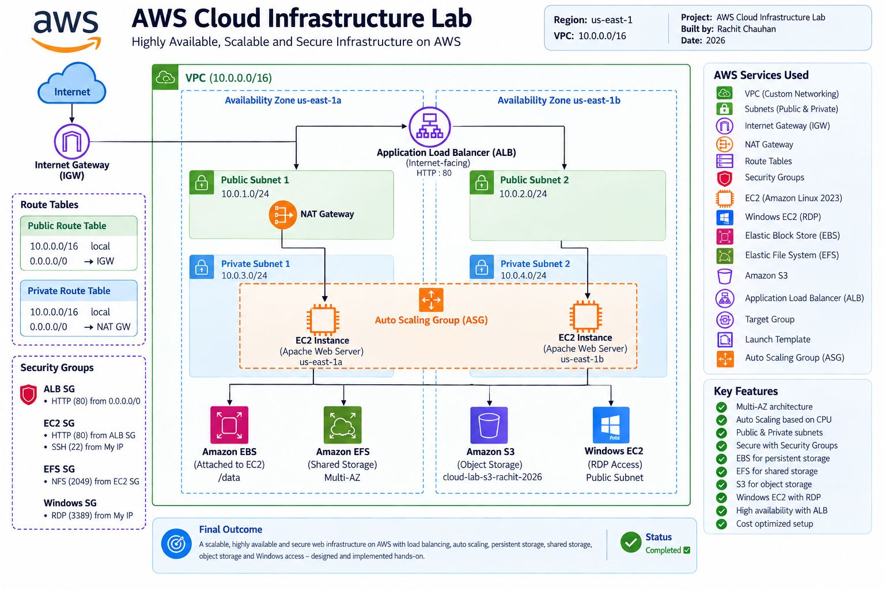

# AWS Cloud Infrastructure Lab

A hands-on AWS cloud infrastructure project built to demonstrate
core cloud networking, compute, storage, security, load balancing,
and auto scaling concepts.

The infrastructure was designed and implemented in the
AWS US East (N. Virginia) region (`us-east-1`).

---

## Architecture

The architecture uses a custom VPC with public and private subnets
distributed across two Availability Zones.

Internet traffic reaches the Application Load Balancer through the
Internet Gateway. The Load Balancer distributes HTTP traffic to
Amazon EC2 instances managed by an Auto Scaling Group in private
subnets.

A NAT Gateway provides outbound internet connectivity for resources
in the private subnets.

---

## AWS Services Used

- Amazon VPC
- Subnets
- Internet Gateway
- NAT Gateway
- Route Tables
- Security Groups
- Amazon EC2
- Amazon EBS
- Amazon EFS
- Amazon S3
- Application Load Balancer (ALB)
- Target Groups
- Launch Template
- Auto Scaling Group
- Windows EC2 with RDP

---

## Network Architecture

### VPC

- VPC Name: `cloud-lab-vpc`
- CIDR: `10.0.0.0/16`
- Region: `us-east-1`

### Public Subnets

| Subnet | CIDR | Availability Zone |
|---|---|---|
| public-subnet-1 | `10.0.1.0/24` | us-east-1a |
| public-subnet-2 | `10.0.2.0/24` | us-east-1b |

### Private Subnets

| Subnet | CIDR | Availability Zone |
|---|---|---|
| private-subnet-1 | `10.0.3.0/24` | us-east-1a |
| private-subnet-2 | `10.0.4.0/24` | us-east-1b |

The public route table provides internet access through the
Internet Gateway.

The private route table routes outbound traffic through the
NAT Gateway.

---

## Compute

### Linux EC2

- Amazon Linux 2023
- Instance type: `t3.micro`
- Apache HTTP Server
- SSH access
- Custom HTML web page

The Linux EC2 instance was configured as an Apache web server
and tested successfully.

### Windows EC2

- Windows Server
- Instance type: `t3.micro`
- RDP access
- RDP restricted to the user's IP address

---

## Storage

### Amazon EBS

An encrypted 5 GiB gp3 EBS volume was created and attached
to the Linux EC2 instance.

The volume was formatted with XFS and mounted on the instance.

### Amazon EFS

Amazon EFS was configured as shared file storage.

- Regional EFS
- Mount targets across Availability Zones
- NFS access through Security Groups
- Mount and read/write operations tested successfully

### Amazon S3

An S3 bucket was created for object storage.

Configuration included:

- Block Public Access enabled
- Versioning enabled
- Server-side encryption using SSE-S3
- Object upload and download testing

---

## Security

Security Groups were used to control network access.

### ALB Security Group

- HTTP (80) from the internet

### EC2 Security Group

- SSH (22) from My IP
- HTTP (80) from the ALB Security Group
- NFS (2049) from the EC2 Security Group

### Windows Security Group

- RDP (3389) from My IP

This configuration limits direct access to the application
servers and allows HTTP traffic through the Load Balancer.

---

## Application Load Balancer

An internet-facing Application Load Balancer was configured
across two Availability Zones.

### Configuration

- HTTP listener on port 80
- Target Group using HTTP port 80
- Health check path: `/`
- EC2 targets monitored using health checks

The ALB successfully distributed traffic to healthy Apache
web servers.

---

## Auto Scaling

An Auto Scaling Group was configured using a Launch Template.

### Configuration

- Minimum capacity: `1`
- Desired capacity: `2`
- Maximum capacity: `2`
- Instance type: `t3.micro`
- CPU target tracking: `50%`
- Health checks: EC2
- Health grace period: `300 seconds`
- Instances distributed across two Availability Zones

The Auto Scaling Group successfully launched and maintained
healthy EC2 instances in the private subnets.

---

## Testing and Verification

The following components were tested during the implementation:

- VPC and subnet configuration
- Internet connectivity
- Linux EC2 SSH access
- Apache web server
- EBS attachment and filesystem mount
- EFS mount and read/write operations
- S3 object upload/download
- Windows EC2 RDP connection
- ALB HTTP access
- Target Group health checks
- Auto Scaling EC2 instances

---

## Project Screenshots

### VPC
[View VPC Screenshots](screenshots/01-vpc/)

### Subnets
[View Subnet Screenshots](screenshots/Subnet/)

### Internet Gateway
[View Internet Gateway Screenshots](screenshots/Internet-Gateway/)

### Route Tables

[View Public Route Table Screenshots](screenshots/Public%20Route%20Table/)

[View Private Route Table Screenshots](screenshots/Private%20Route%20Table/)

### NAT Gateway
[View NAT Gateway Screenshots](screenshots/NAT-Gateway/)

### Security Groups
[View Security Group Screenshots](screenshots/Security%20Group/)

### Linux EC2
[View Linux EC2 Screenshots](screenshots/Linux%20EC-2/)

### EBS
[View EBS Screenshots](screenshots/EBS/)

### EFS
[View EFS Screenshots](screenshots/EFS/)

### S3
[View S3 Screenshots](screenshots/S3/)

### Windows EC2 / RDP
[View Windows EC2 Screenshots](screenshots/Windows-EC2/)

### Application Load Balancer
[View Load Balancer Screenshots](screenshots/Load%20balancer/)

### Auto Scaling
[View Auto Scaling Screenshots](screenshots/Auto%20Scaling/)

---

## Key Concepts Demonstrated

- AWS VPC networking
- Public and private subnet design
- Multi-AZ architecture
- Internet Gateway
- NAT Gateway
- Route Tables
- Security Groups
- EC2 administration
- Apache web server
- EBS block storage
- EFS shared file storage
- S3 object storage
- Application Load Balancer
- Target Groups and health checks
- Launch Templates
- Auto Scaling
- Windows RDP administration

---

## Cost Management

This project was created as a hands-on learning lab.

When the infrastructure is not being used, billable resources
such as EC2, NAT Gateway, Application Load Balancer, and other
storage/network resources should be stopped or removed as
appropriate to avoid unnecessary AWS charges.

---

## Skills Demonstrated

**Cloud:** AWS  
**Networking:** VPC, Subnets, Route Tables, IGW, NAT Gateway  
**Compute:** EC2, Auto Scaling  
**Storage:** EBS, EFS, S3  
**Load Balancing:** Application Load Balancer  
**Security:** Security Groups, SSH, RDP, NFS  
**Web Server:** Apache HTTP Server  
**Operating Systems:** Amazon Linux, Windows Server
